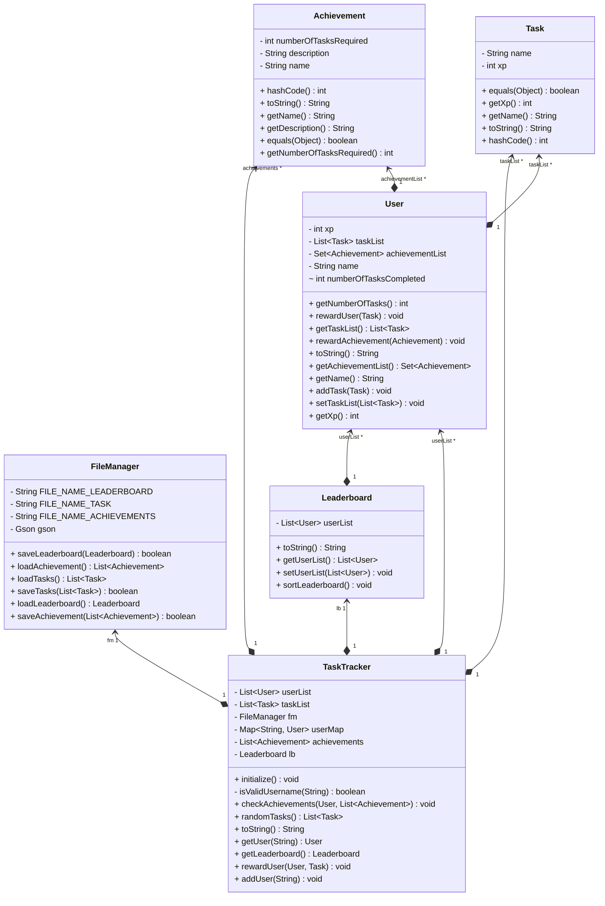

# LevelUp: A Gamified Habit & Time Management Tracker for Students

**LevelUp** is a Java console-based project designed to help students build productive habits and manage their time more effectively — while keeping motivation high through gamification 🎯

Every completed task earns XP, achievements, and leaderboard ranks — turning daily productivity into a fun, rewarding experience!

---

## 🚀 Features

- 👤 **User Accounts** — Add multiple users and track their progress individually  
- ✅ **Tasks System** — Create and complete tasks to earn XP  
- 🏆 **Achievements** — Unlock milestones for completing tasks  
- 📈 **Leaderboard** — Compare users by XP in real-time  
- 💾 **Persistent Data** — All data saved and loaded from a local JSON file  
- ⚙️ **Configurable** — Use CLI args and/or system properties to choose data files and startup mode  
- 🧯 **Robust Error Handling** — Handles multiple IO/parse/input exceptions and uses custom domain exceptions  

---

## ▶️ How to Run

Build a runnable JAR (already provided under `target/`), then run with one of the following modes:

- Help
  ```bash
  java -jar target/LevelUp-standalone.jar -h
  ```
- Initialize demo data (tasks, achievements, leaderboard)
  ```bash
  java -jar target/LevelUp-standalone.jar -init
  ```
- Add a user
  ```bash
  java -jar target/LevelUp-standalone.jar -add Alice
  ```
- Launch the app for a user
  ```bash
  java -jar target/LevelUp-standalone.jar -launch Alice
  ```

### Optional configuration (system properties)
You can override the default JSON file locations using Java system properties:
```
-Dlevelup.leaderboard=path/to/leaderboard.json 
-Dlevelup.tasks=path/to/task.json 
-Dlevelup.achievements=path/to/achievement.json
```
Example:
```bash
java -Dlevelup.tasks=data/tasks.json -jar target/LevelUp-standalone.jar -init
```

---

## 🧱 Technologies Used

| Component | Technology |
|------------|-------------|
| Language | Java 21 |
| Build Tool | Maven |
| JSON Library | Gson (by Google) |
| IDE (recommended) | IntelliJ IDEA |

---

## 🧩 Design Overview (Diagram)

The following class diagram outlines core classes, interfaces and relationships. It also highlights collections (List, Set, Map) usage.



---

## ✅ Rubric Checklist Mapping

- 4+ classes and 2+ interfaces: `TaskTracker`, `FileManager`, `User`, `Task`, `Achievement`, `Leaderboard` + interfaces `Trackable`, `Rewardable`
- Uses at least two collections: `List`, `Set`, and `Map` are used
- Stores/reads data from files: JSON via `FileManager` (Gson)
- Config/program arguments: CLI modes (`-h`, `-init`, `-add`, `-launch`) and optional `-Dlevelup.*` properties
- Handles 3+ language exceptions: `FileNotFoundException`, `IOException`, `JsonSyntaxException`, `InputMismatchException`
- 2 custom exceptions: `DuplicateUserException`, `UserNotFoundException`
- Input validation: username format, menu choice validation, bounds checks on task selection

---

This project is open-source and available under the [MIT License](LICENSE)
